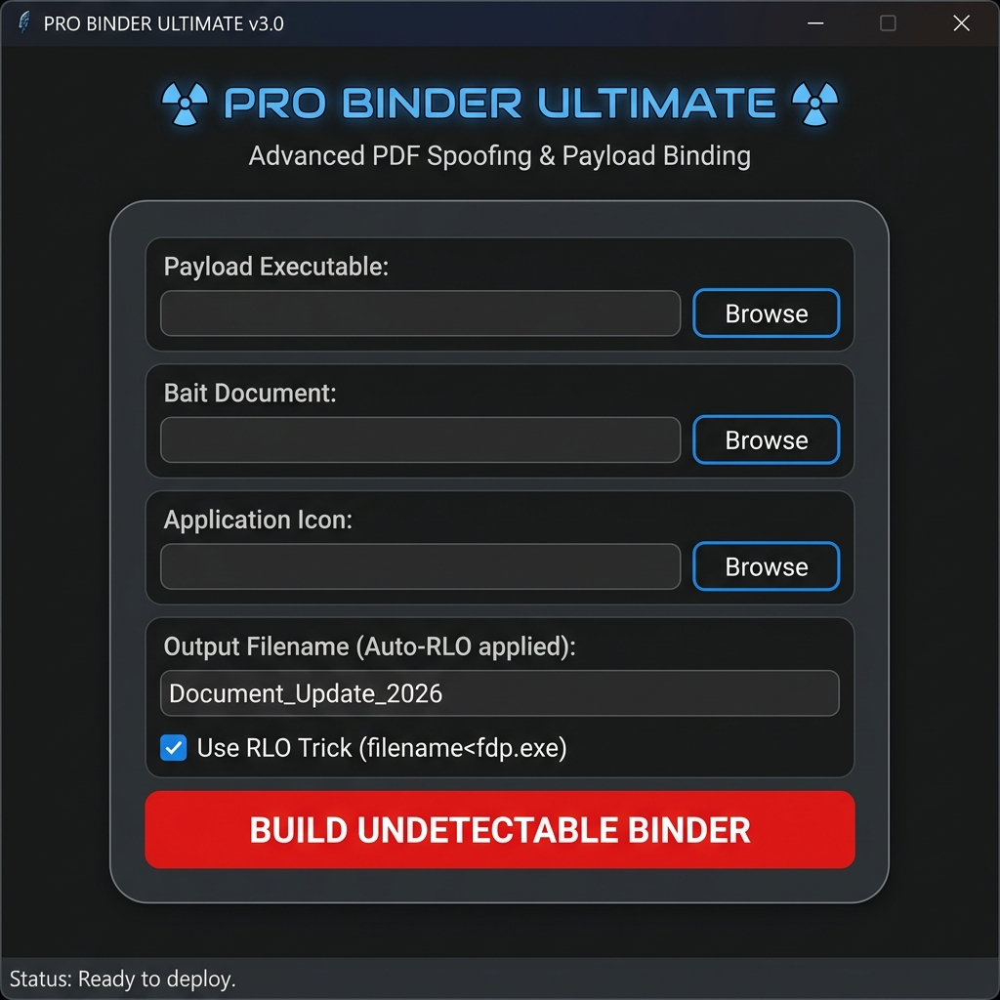
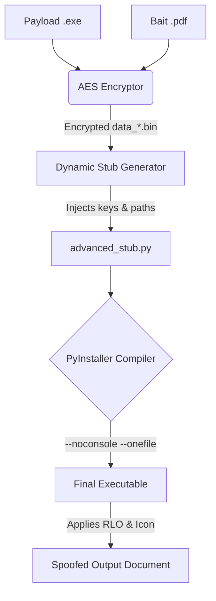

<div align="center">

# ☢️ Pro Binder Ultimate

**Advanced Payload Binding & Spoofing Framework**

[](https://www.python.org/)
[](https://github.com/TomSchimansky/CustomTkinter)
[](https://cryptography.io/)
[](#-disclaimer)

<br />

*A sophisticated tool for red teams and security researchers to bind executables with decoy documents, utilizing cryptographic obfuscation and Right-to-Left Override (RLO) spoofing techniques.*

<br />



<br />

[Features](#-features) •
[Installation](#-installation) •
[Usage Guide](#-usage-guide) •
[Architecture](#-architecture) •
[Disclaimer](#-disclaimer)

</div>

---

## ⚠️ Disclaimer

**This tool is strictly for educational purposes and authorized penetration testing only.** 
The developers assume no liability and are not responsible for any misuse or damage caused by this program. Binding payloads to legitimate documents without explicit authorization is illegal. Do not use this tool on systems you do not own or have explicit permission to test.

---

## ✨ Features

<table>
  <tr>
    <td width="50%">

### 🛡️ Obfuscation & Evasion
- **Military-grade AES Encryption**: Payloads and decoy files are encrypted using the Fernet symmetric algorithm to evade signature-based AV detection.
- **Dynamic Stub Generation**: A unique `advanced_stub.py` is compiled for every build with randomized variable names and dynamic keys.
- **In-Memory Decryption**: Payloads are decrypted seamlessly into temporary directories at runtime.

</td>
<td width="50%">

### 🎭 Visual Spoofing (RLO)
- **Extension Spoofing**: Built-in support for Right-to-Left Override (`U+202E`) Unicode character manipulation.
- Make an executable appear as a legitimate document (e.g., `Report_2026‮fdp.exe` renders visually as `Report_2026exe.pdf`).
- **Icon Binding**: Automatically inject custom `.ico` files (like a standard PDF icon) into the compiled executable.

</td>
  </tr>
  <tr>
    <td>

### 🚀 Seamless Execution
- **Asynchronous Execution**: Uses multithreading to instantly launch the decoy document (e.g., PDF) to distract the user, while the payload executes silently in the background.
- **No Console Window**: Built with PyInstaller `--noconsole` to ensure the background process remains completely invisible.

</td>
<td>

### 🎨 Modern Dark-Mode GUI
- Sleek and professional interface built with `customtkinter`.
- Intuitive workflow: Select Payload -> Select Decoy -> Build.
- Real-time build status tracking.

</td>
  </tr>
</table>

---

## 📦 Installation

### Prerequisites
- Python 3.8 or higher
- Windows OS (recommended for `.exe` generation)

### Setup

1. **Clone the repository:**
   ```bash
   git clone https://github.com/khacdai24/pro_binder.git
   cd pro_binder
   ```

2. **Install dependencies:**
   ```bash
   pip install customtkinter Pillow cryptography pyinstaller
   ```

---

## 📖 Usage Guide

### Using the GUI (Recommended)

1. Run the graphical interface:
   ```bash
   python ProBinderGUI.py
   ```
2. **Payload Executable**: Browse and select your target `.exe` (e.g., a reverse shell or the included `troll.py` built into an executable).
3. **Bait Document**: Select a legitimate decoy file, typically a `.pdf`.
4. **Application Icon**: (Optional) Select a `.ico` file. A default `pdf_icon.ico` is provided.
5. **Output Filename**: Enter the desired base name for your file.
6. **RLO Trick**: Check the box to automatically apply the Unicode right-to-left override.
7. Click **BUILD UNDETECTABLE BINDER**. 
8. The final stealth executable will be generated in the `output/` directory.

### Example: Testing with the Troll Payload

We have provided a harmless `troll.py` payload for testing purposes:
1. Compile the troll payload into an executable first:
   ```bash
   pyinstaller --onefile --noconsole troll.py
   ```
2. Open `ProBinderGUI.py`.
3. Select `dist/troll.exe` as the Payload.
4. Select any harmless `.pdf` as the Bait.
5. Click Build. Running the output will open the PDF normally while simultaneously locking the screen with the Troll image in the background.

---

## 🔧 Architecture & Workflow



### Execution Flow on Target Machine:
1. User double-clicks the spoofed executable.
2. `advanced_stub` executes completely invisibly.
3. Thread 1: Decrypts the Bait PDF into `%LocalAppData%\Temp\<random>` and opens it via `os.startfile()`.
4. Thread 2 (Delayed by 1.2s): Decrypts the Payload EXE and executes it silently via `subprocess.Popen`.

---

## 📂 Project Structure

```text
pro_binder/
├── ProBinderGUI.py      # Main graphical interface
├── binder.py            # CLI version / Core binding logic
├── advanced_stub.py     # Execution engine injected into final build
├── troll.py             # Sample benign payload for testing
├── apply_rlo.py         # Utility for Unicode RLO testing
├── pdf_icon.ico         # Default decoy icon
└── README.md            # This documentation
```

---

<div align="center">

**Developed by [@khacdai24](https://github.com/khacdai24)**

*If you found this tool educational, consider giving the repository a ⭐*

</div>
